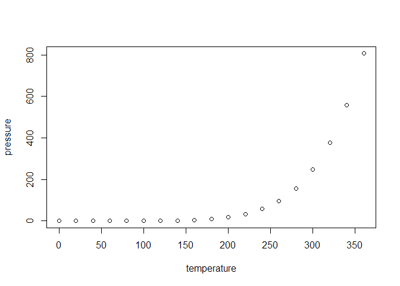

<!-- README.md is generated from README.Rmd. Please edit that file -->

# mojpakiet

<!-- badges: start -->
<!-- badges: end -->

Celem pakietu jest udostępnienie funkcji umożliwiających obliczenie
zwarcia poziomego koron drzew na podsdtawie danych Lotniczego Skanowania
Laserowego (ALS).

## Installation

Można zainstalować deweloperską wersję pakietu mojpakiet z
[GitHub](https://github.com/) poprzez:

``` r
# install.packages("devtools")
devtools::install_github("wkravchyk/mojpakiet")
```

## Przykład

Podstawowa funkcjonalność:

``` r
#library(mojpakiet)
## basic example code
```


